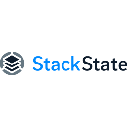

# Steadybit extension-stackstate

A [Steadybit](https://www.steadybit.com/) extension to integrate [Stack State](https://www.stackstate.com/) into Steadybit.

Learn about the capabilities of this extension in our [Reliability Hub](https://hub.steadybit.com/extension/com.steadybit.extension_stackstate).

## Prerequisites

You need to have a StackState service token. The following steps describe how to create one:
- Install the StackState CLI: https://<your-company>.app.stackstate.io/#/cli
- Run `sts service-token create --name steadybit-integration --roles stackstate-k8s-troubleshooter`


## Configuration

| Environment Variable                                        | Helm value                              | Meaning                                                                                                                 | Required | Default |
|-------------------------------------------------------------|-----------------------------------------|-------------------------------------------------------------------------------------------------------------------------|----------|---------|
| `STEADYBIT_EXTENSION_SERVICE_TOKEN`                         | `stackstate.serviceToken`               | Stack State Service Token                                                                                               | yes      |         |
| `STEADYBIT_EXTENSION_API_BASE_URL`                          | `stackstate.apiBaseUrl`                 | Stack State API Base URL (example: https://yourcompany.app.stackstate.io/api)                                           | yes      |         |
| `STEADYBIT_EXTENSION_DISCOVERY_ATTRIBUTES_EXCLUDES_SERVICE` | `discovery.attributes.excludes.service` | List of Service Attributes which will be excluded during discovery. Checked by key equality and supporting trailing "*" | no       |         |


The extension supports all environment variables provided by [steadybit/extension-kit](https://github.com/steadybit/extension-kit#environment-variables).

## Installation

### Kubernetes

Detailed information about agent and extension installation in kubernetes can also be found in
our [documentation](https://docs.steadybit.com/install-and-configure/install-agent/install-on-kubernetes).

#### Recommended (via agent helm chart)

All extensions provide a helm chart that is also integrated in the
[helm-chart](https://github.com/steadybit/helm-charts/tree/main/charts/steadybit-agent) of the agent.

You must provide additional values to activate this extension.

```
--set extension-stackstate.enabled=true \
--set extension-stackstate.stackstate.serviceToken="{{SERVICE_TOKEN}}" \
--set extension-stackstate.stackstate.apiBaseUrl="{{API_BASE_URL}}" \
```

Additional configuration options can be found in
the [helm-chart](https://github.com/steadybit/extension-stackstate/blob/main/charts/steadybit-extension-stackstate/values.yaml) of the
extension.

#### Alternative (via own helm chart)

If you need more control, you can install the extension via its
dedicated [helm-chart](https://github.com/steadybit/extension-stackstate/blob/main/charts/steadybit-extension-stackstate).

```bash
helm repo add steadybit-extension-stackstate https://steadybit.github.io/extension-stackstate
helm repo update
helm upgrade steadybit-extension-stackstate \
    --install \
    --wait \
    --timeout 5m0s \
    --create-namespace \
    --namespace steadybit-agent \
    --set stackstate.serviceToken="{{SERVICE_TOKEN}}" \
    --set stackstate.apiBaseUrl="{{API_BASE_URL}}" \
    steadybit-extension-stackstate/steadybit-extension-stackstate
```

### Linux Package

This extension is currently not available as a Linux package.

## Extension registration

Make sure that the extension is registered with the agent. In most cases this is done automatically. Please refer to
the [documentation](https://docs.steadybit.com/install-and-configure/install-agent/extension-discovery) for more
information about extension registration and how to verify.
